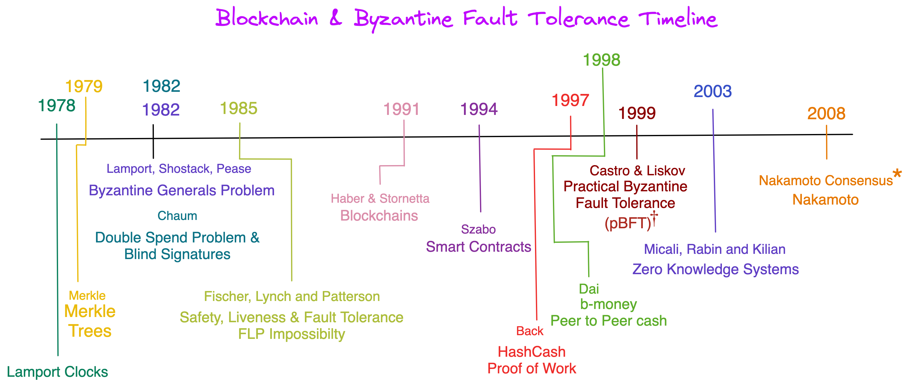
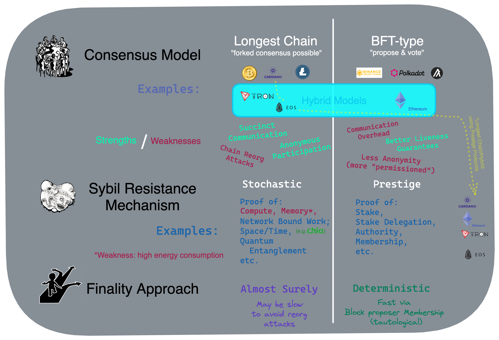

<h2 align="center"><em>"Ethereum is a slow, expensive computer and that is an intentional design decision."</em> - Vitalik Buterin</h2>

## History of Fault Tolerance in Distributed Computing

Fault-tolerant computing is a field of computer science that deals with the ability of computer systems to continue operating even in the presence of hardware or software failures. The history of fault-tolerant computing can be traced back to the 1970s, with the development of Lamport clocks, and has since evolved through several key technologies, including replication, consensus algorithms, and blockchain, culminating in the development of Nakamoto consensus. These techniques are generally referred to Byzantine Fault Tolerance (or BFT).

In the 1970s, Leslie Lamport introduced the concept of logical clocks, or Lamport clocks, which were used to establish the order of events in distributed systems. Lamport clocks provided a way for nodes in a distributed system to synchronize their clocks without the need for a central clock, which was prone to failure. This allowed distributed systems to continue operating even in the event of clock failures.

Replication was another key technology in the development of fault-tolerant computing. In the 1980s, researchers began to explore the use of replication to provide fault tolerance in distributed systems. By replicating data or services across multiple nodes, a system could continue to function even if one or more nodes failed. Replication also enabled load balancing, as requests could be spread across multiple nodes, improving the overall performance of the system.

Consensus algorithms were another key development in the evolution of fault-tolerant computing. These algorithms were designed to allow distributed systems to make decisions even in the presence of failures. In the 1990s, the Paxos algorithm was developed, which enabled a distributed system to reach consensus on a value even if some of the nodes failed. This enabled fault tolerance in systems where decisions needed to be made, such as in distributed databases.

The concept of blockchain was introduced in 1991, with the publication of the Bitcoin whitepaper by Satoshi Nakamoto. Blockchain is a distributed ledger technology that provides a tamper-proof record of transactions. By using a consensus algorithm to validate transactions, blockchain provides a high degree of fault tolerance, as the records cannot be altered without the consensus of the network.

Nakamoto consensus, named after the creator of Bitcoin, is the consensus algorithm used in the Bitcoin network. This algorithm uses proof-of-work to validate transactions, and once a block is added to the blockchain, it cannot be altered without invalidating the entire chain. This provides a high degree of fault tolerance, as the records on the blockchain are tamper-proof.

<h5 style="text:italic" align="center"><em>

</img>

Note: If you have `git cloned` the above image locally the text for the milestones above are clickable. Otherwise, you may go to the end of this document to find them. There are high level descriptions and primary reference work available in the links. The last one, labeled "Nakamoto consensus," by Tim Roughgarden is highly recommended. He reviews a more detailed timeline in his talk and will prepare your understanding for the consensus section below.
</em></h5> 

[Goto Visual References](#refs)

Blockchain development, including cryptocurrencies, are one of the most vibrant areas in computer science research. The sector has attracted a great deal of investment as well as talented individuals. Going forward, there a number of open questions still deserving more research and development work. These include integrating new consensus approaches, quantum information theory, as well as machine learning applications on blockchains. This document and visuals barely scratch the surface of the space. Future coursework could spend an entire semester on just this topic and the concept of consensus.

## Consensus

All blockchains require a synchronized state, otherwise called consensus.  The early work in this areas was known as "state machine replication," and this preceded BFT-type and Nakamoto consensus by several decades (see [Roughgarden's foundations of Blockchain videos](https://youtube.com/playlist?list=PLEGCF-WLh2RLOHv_xUGLqRts_9JxrckiA)). Although, practical Byzantine Fault Tolerance was created approximately a decade ahead of the invention of Nakamoto Consensus, it was not well recognized as a way to scalably solve the double spend problem. Many think this was due to the lack of anonymity provided by the approach. This is well articulated in the Roughgarden video at the end of this document.

>>> *This table outlines the major blockchain approaches to consensus. There is a slight divergence from research community terminology in that it dissects "proof of work and stake" sybil resistance mechanisms into "stochastic" and "prestige" approaches. We differentiate between these approaches to allow for a better understanding of the strengths and weaknesses of these as well as examining the requirements for future blockchain systems. In addtion, this classification layering should help prepare ourselves for future research in hybrid classical and quantum information theory as it applies to blockchain.*

</img>

The above diagram describes the core aspects of consensus and how it relates to the current cryptocurrency ecosystem. These topics do not represent a comprehensive organizational list for consensus. Safety, liveness in addition to partial, asynchronous, and synchronous models are other significant areas to review in the context of byzantine fault tolerance. The [FLP impossibility](#flp) in the references provides good context for the first two items while more detailed information on [synchronizationcan be found in Decentralized Thoughts Synchronous Models here](https://decentralizedthoughts.github.io/2019-06-01-2019-5-31-models/). In this document, we will focus on these three key aspects: the *Consensus Model*, *Sybil Resistance*, and *Finality*. The other items will be left for another more theoretical discussion. 

###  Consensus Models

Consensus models describe the method used to obtain agreement across the network for the participating nodes. Although there are others, there are two primary methods used today for consensus models: "longest chain" and "BFT-type." The longest chain approach allows for the mining process which produces new blocks on the chain to extend the chain upon the solution to a cryptographic puzzle. The network can fork into new chains and per the longest chain rule, the chain with the greatest number of blocks becomes the canonical chain. Under BFT-type models, there is a "propose and vote" approach to block production. Generally speaking, blocks are proposed, a committee of validators review and "vote" on the candidate blocks then verified blocks extend the blockchain. BFT-type consensus offers a number of advantages, including mitigation against chain reorganization attacks because the committe system defines the rules for valid blocks and penalizes block proposers which attempt to produce invalid blocks. Nakamoto Consensus generally refers to systems which use a "proof of work" sybil resistance mechanism in addition to longest chain although some research community members use longest chain and Nakamoto Consensus interchangeably.

The diagram also details where a number of popular cryptocurrencies fit into the consensus model. Post merge, ETH 2 for example uses a hybrid approach when it comes to the consensus model. In addition, coins like Cardano use longest chain while also using proof of stake sybil resistance (see below). At a high level, the two primary consensus model methods have different strengths and weaknesses. One of the primary challenges has been chain reorg attacks for longest chain models. Meanwhile, BFT-type consensus has more communication overhead and as proposers join committees under this regime, there is a loss of anonymity for participants. Another key concept in Byzantine Fault Tolerant systems is the notion of liveness. This refers to the blockhain's ability to continue operating under faults whether they be byzantine (malicious or due to execution defects) as well as network partitions. Since BFT-type consensus allows the committe to define how to move forward in the advent of attackes and faults, it has much greater flexibility in insuring its liveness. Longest chain consensus operates under a simplified set of assumptions and does not require any committee membership to produce a block. Anonymous mining nodes may join the network and produce blocks as long as they use the sybil resistance mechanism detailed below. Therefore, the simplicity and elegance of the approach also means it cannot provide as sophisticated liveness properties.

###  Sybil Resistance

People in the crypto ecosystem oftent conflate "proof of work and stake" as a form of consensus when actuality the two methods are used for sybil resistance. The word Sybil in sybil resitance refers to a story about a multiple personaility disorder patient in a (story from the 1970s)[https://m.imdb.com/title/tt0075296/]. Modern day blockchains run without permission. This is one of the great advancements Nakamoto Consensus provided with Bitcoin. Up until this point, with state machine replication models such a p-BFT, the participating nodes on the network had to "know" one another. Prior to that advancement, fault tolerant networks used public key infrastructure (PKI) which required all parties (nodes) in the system to operate under those assumptions. As such, and with permissionless, systems a single node could have "multiple personalities." Thus, the term sybil resistance emerged.

Sybil attacks occur where a single participant can act as though it is multiple nodes. Since modern blockchains to operate in permissionless ways, a simple attack vector on the networks is to either have mutliple votes, block proposals, or other consensus operations to dominate the network and determine who and how blocks are produced. The major present solution to this problem is stochastic or prestige proofs. Proof of work is always used with longest chain consensus since it operates in a completely permissionless setting. While prestige based proof of stake is generally used with BFT-type consensus. Both of these mechanisms mitigate against sybil attacks. Some blockchains use hybrid consensus models or longest chain and also use a prestige method for sybil resistance. These are highlighed in the diagram with the yellow line on the right side. There is some theorems and research that indicates a natural alignment between longest chain and stochastic proofs while also indicating that BFT-type models and prestige proofs are more congruent. (See [Roughgarden's foundations of Blockchain videos](https://youtube.com/playlist?list=PLEGCF-WLh2RLOHv_xUGLqRts_9JxrckiA) for details).

Stochastic proofs typically involve solving a hard cryptographic puzzle whereby the first node in the network that provides the solution receives a block reward. This is referred to as "proof of work," and Bitcoin originated this approach. Many groups are critical of proof of work since they perceive it to use a great deal of energy to secure the network. Although, this is a misconception. There are several other types of proof of work which do not have high energy consumption listed in the diagram. Prestige proofs are usually referred to as "proof of" stake, membership, authority, etc. The prestige proofs usually involve a membership participation, block proposition, voting, and validation sequence with penalties for malicious actors.   

###  Finality

Finality, is one of the great operational differences with blockchains. Bitcoin users will typically wait for 6 confirmations which takes approaximately one hour for a transaction to be considered invulnerable to a chain reorg attack and invulnerable to a double-spend. Meanwhile, Ethereum users will generally consider a transaction invulnerable to double spends after 4 confirmations or so which takes approaximately one minute. [Joachim Neu provides the metaphor for "coffee shop" versus "car dealer" transactions and why a hybrid consensus model is desirable](https://youtu.be/2nMS-TK_tMw). We refer to a blockchain transaction to be "final" once it is considered safe that the blocks produced up that point thus far are not likely to be changed. Funadamentally, the immutable state of the blockchain insures the value of the underlying cryptocurrency. As such, there are two primary approaches to insuring that immutable state: deterministic and "almost surely" probability. These two finality mechanisms have different motivations for use and are aligned with the BFT-type and longest chain consensus models, respectively. There have been some visible apparent chain reorg attacks on blockchains [such as Ethereum Classic](https://cryptobriefing.com/ethereum-classic-reorg-coinbase-etc/). As such, hybrid models as well as BFT-type consensus using prestige proofs are generally considered to be superior in their finality performance. Since these approaches use a membership-type model to propose and validate blocks, the rules of the committee comprise a tautological rule set for finality. 

##  Smart Contracts and Blockchain

Decentralized computing offers a number of advantages over traditional centralized systems. Firstly, blockchain technology provides a high degree of transparency and immutability. Once data is recorded on the blockchain, it cannot be altered or deleted without the consensus of the network. This feature is particularly valuable for applications where data integrity is critical, such as financial transactions, supply chain management, or voting systems. With a traditional fault-tolerant system, data may be replicated across multiple nodes, but it is still possible for a node to be compromised, leading to the alteration or deletion of data. In contrast, blockchain technology provides an additional layer of security by making it difficult for an attacker to tamper with the data.

Secondly, blockchain technology offers a decentralized architecture that enables peer-to-peer communication without the need for a central authority. In a traditional fault-tolerant system, there may be a single point of failure, such as a central server, that can bring down the entire system. With a blockchain-based system, there is no central authority, and the nodes work together to maintain the system. This architecture is more resilient to attacks, as it is more difficult to bring down the entire system.

Thirdly, blockchain technology offers a high degree of fault tolerance without the need for complex consensus algorithms. In a traditional fault-tolerant system, achieving consensus can be challenging and often requires complex algorithms that are difficult to implement and maintain. In contrast, blockchain technology uses a simple but effective consensus algorithm, which ensures that all nodes in the network agree on the state of the system. This simplicity makes it easier to implement and maintain a fault-tolerant system based on blockchain technology.

Lastly, blockchain technology offers a high degree of interoperability, which means that different blockchain-based systems can communicate with each other seamlessly. This interoperability enables the creation of a decentralized ecosystem, where multiple blockchain-based systems can work together to provide more value to users. In contrast, traditional fault-tolerant systems are often proprietary, making it difficult to integrate them with other systems.

## Challenges & Opportunities

There are many remaining problems to be solved as well as theoretical limitations to blockchain technology. These include the trilemna limitation, scaling, as well as fee models.

### The Blockchain Trilemna Conjecture 

Vitalik Buterin, the co-founder of Ethereum, introduced the concept of the "blockchain trilemma," which refers to the trade-off between three key attributes of a blockchain system: security, scalability, and decentralization. The blockchain trilemma highlights the fact that it is difficult, if not impossible, to achieve all three attributes simultaneously in a blockchain system, and that any improvement in one attribute may come at the cost of another.

Security refers to the degree of protection against attacks or malicious behavior in a blockchain system. A secure blockchain must be able to prevent double-spending attacks, 51% attacks, and other types of attacks that can compromise the system. To achieve high security, a blockchain must have a high degree of computational power and consensus among nodes, which can make it more difficult to achieve scalability and decentralization.

Scalability refers to the ability of a blockchain system to handle a large number of transactions without compromising its performance. Scalability is essential for blockchain systems that need to process a high volume of transactions, such as payment systems or supply chain management systems. However, increasing scalability often requires sacrificing either security or decentralization. For example, some approaches to scalability involve reducing the number of nodes in the network, which can compromise decentralization, or reducing the level of computational power needed to validate transactions, which can compromise security.

Decentralization refers to the distribution of decision-making power among nodes in a blockchain system. A decentralized system has no single point of control, which makes it more resistant to attacks and censorship. However, achieving high decentralization often comes at the cost of scalability and security. For example, a highly decentralized system may have more nodes to achieve consensus, which can make it slower and more vulnerable to attacks.

The blockchain trilemma highlights the fact that it is challenging to achieve all three attributes simultaneously, and that any improvement in one attribute may come at the cost of another. For example, improving scalability by reducing the number of nodes can compromise decentralization, or increasing security by increasing computational power can compromise scalability. Thus, designers of blockchain systems must carefully consider the trade-offs between these attributes and choose the best balance for their specific use case.

### Scaling

There a number of techniques to improve the scalability of blockchains. These include sharding and virtual machine concurrency through new computer science techniques such as Rho calculus.

Sharding is a technique that can help improve the scalability of blockchains by allowing for parallel processing of transactions.

In a traditional blockchain system, all nodes on the network must process and validate every transaction. This means that as more transactions are added to the blockchain, the time it takes for each node to process and validate them increases, which can lead to slow transaction processing times and increased network congestion.

Sharding addresses this issue by breaking up the blockchain into smaller subsets of nodes, called shards. Each shard is responsible for processing and validating a subset of the transactions on the network, rather than all of them.

By partitioning the network in this way, each shard can operate independently and in parallel, processing transactions simultaneously with other shards. This allows for more transactions to be processed in a shorter amount of time, increasing the overall transaction throughput of the network.

In addition to improving transaction processing times, sharding can also help reduce the storage requirements for nodes on the network. Since each node only needs to store a subset of the blockchain data, the overall storage requirements for the network can be significantly reduced.

Overall, sharding is a promising technique for improving the scalability of blockchains and enabling them to support higher transaction volumes without sacrificing security or decentralization. However, it requires careful design and implementation to ensure that the shards are sufficiently secure and do not compromise the integrity of the network.

Rho calculus is a process calculus that provides a mathematical framework for specifying and reasoning about concurrent and distributed systems. It is a formal language that allows the expression of computational processes as sets of independent and concurrently running processes, and supports communication and synchronization between these processes.

In the context of blockchain virtual machines, Rho calculus can help scale the system by providing a more efficient way of executing smart contracts. Smart contracts are self-executing programs that run on the blockchain and can automatically enforce the rules and regulations of a transaction. They are an essential component of the blockchain, but they can also cause scalability issues due to their computational complexity and the need for coordination between multiple parties.

Rho calculus can help address these issues by enabling parallel execution of smart contracts, which can greatly increase the throughput of the system. This is achieved by breaking down smart contracts into smaller independent processes that can execute concurrently, without the need for coordination or communication between them.

In addition to parallel execution, Rho calculus also provides a mechanism for efficient message passing between processes, which can reduce the latency and overhead of communication between smart contracts. This can further improve the scalability of the system by allowing it to handle more transactions in a shorter amount of time.

Overall, Rho calculus provides a powerful mathematical framework for specifying and reasoning about concurrent and distributed systems, and can help scale blockchain virtual machines by enabling efficient parallel execution and communication between smart contracts.
### Fee Models and Layer 2s

In the context of Ethereum, the fee model is based on a concept called "Gas," which is the unit of computational work required to execute a transaction on the Ethereum network. Each transaction on the Ethereum network consumes a certain amount of Gas, which is proportional to the amount of computational work required to execute the transaction.

The Gas fee is paid in Ether, the native cryptocurrency of the Ethereum network, and is used to compensate the network nodes that perform the computational work required to execute the transaction. The Gas fee is calculated by multiplying the Gas price, which is the amount of Ether paid per unit of Gas, by the amount of Gas required to execute the transaction. The Gas price is determined by the market, with users bidding to pay higher or lower fees to have their transactions processed more quickly or more slowly.

The fee model for Ethereum has been a subject of debate, as it can make the system expensive to use, especially during periods of high network congestion. To address this issue, zero-knowledge systems, such as zk-SNARKs, have been proposed as a solution for scaling the Ethereum network.

Zero-knowledge systems allow for the creation of private transactions, where the transaction data is encrypted and kept confidential, even from the network nodes. This means that the network nodes do not need to process the transaction data, reducing the amount of computational work required and therefore the amount of Gas required to execute the transaction.

By using zero-knowledge systems, the amount of Gas required to execute a transaction can be reduced, making the transaction cheaper for the user. This can help to improve the scalability of the Ethereum network by reducing the burden on the network nodes, allowing more transactions to be processed in a given period.

In addition to zero-knowledge systems, other solutions for scaling Ethereum have been proposed, including sharding, state channels, and layer-two protocols. These solutions aim to reduce the burden on the main Ethereum network by enabling transactions to be processed off-chain or by distributing the computational load across multiple sub-networks.
## Future Directions

The crypto sector is so vibrant that it is difficult to list all of the opportunities. Here are a few:
* Machine Learning on Immutable data
* Quantum communciations and consensus
* Zero knowledge systems extensions
* Scaling systems using the above technologies
* Improved interoperability
* Hybridized traditional fault tolerance with byzantine approaches

## <a id="refs">
Visual References
</a>

* [Lamport Clocks: ](https://en.wikipedia.org/wiki/Lamport_timestamp)
* [Merkle Trees: ](https://en.wikipedia.org/wiki/Merkle_tree)
* [Byzantine General's Problem: ](https://lamport.azurewebsites.net/pubs/byz.pdf)
* [Double Spend Problem & Blind Signatures: ](https://komodoplatform.com/en/academy/double-spending-problem/)
<a id="flp">
* [Safety, Liveness & Fault Tolerance: FLP Impossibilty](https://www.youtube.com/watch?v=vJhm9uhd34E)
</a>
* [Blockchains: ](https://www.forbes.com/sites/vipinbharathan/2020/06/01/the-blockchain-was-born-20-years-before-bitcoin/?sh=7c7449515d71)
* [Smart Contracts: ](https://www.fon.hum.uva.nl/rob/Courses/InformationInSpeech/CDROM/Literature/LOTwinterschool2006/szabo.best.vwh.net/smart_contracts_2.html)
* [Hash Cash Proof of Work: ](https://learn.saylor.org/mod/book/view.php?id=30735&chapterid=6706)
* [bmoney: ](http://www.weidai.com/bmoney.txt)
* [Practical Byzantine Fault Tolerance: ](https://www.youtube.com/watch?v=IafgKJN3nwU)
* [Zero Knowledge Systems: ](https://www.youtube.com/watch?v=OcmvMs4AMbM)
* [Nakamoto Consensus (this video covers a great deal more): ](https://www.youtube.com/watch?v=EfsSV7ni2ZM)
