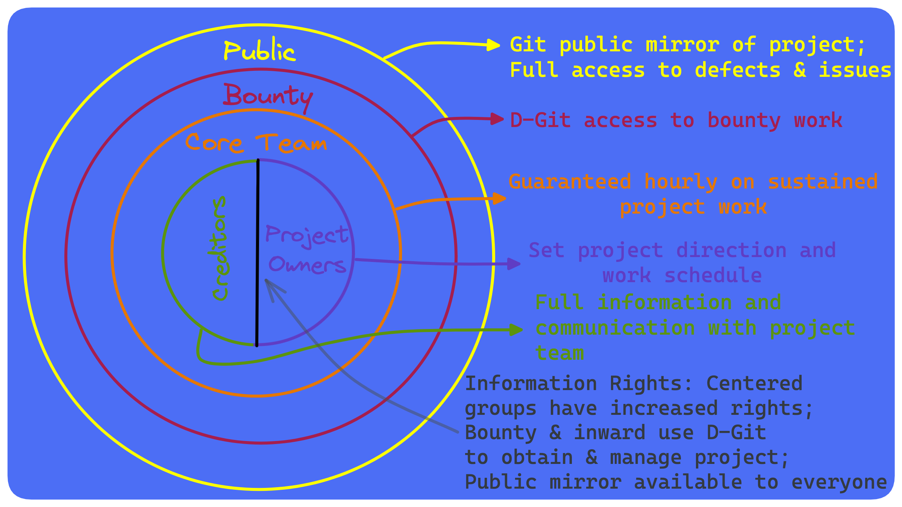

# Lecture 5: Final Project Review

(draft)

## Introduction

Crowdfunding has a rich history, dating back to the Free Software initiative of the late 1980s and early 1990s. This movement sought to promote the sharing and collaboration of software code, with the goal of making software accessible to everyone, regardless of their financial means. In 1997, the Free and Open Source [(FOSS)](https://www.gnu.org/philosophy/floss-and-foss.en.html) software project, (VIM)(https://medium.com/@jovica/the-history-of-vim-b707758fb54f), adopted a charitable funding approach, which allowed users to donate money to support the development of the software. This was one of the earliest examples of crowdfunding in practice.

As the internet and technology advanced, crowdfunding evolved and expanded. In the early 2000s, platforms like Kickstarter and Indiegogo emerged, allowing artists, entrepreneurs, and innovators to raise funds for creative projects. These platforms revolutionized the way people could raise money, and they opened up new opportunities for people to bring their ideas to life.

In recent years, the rise of decentralized cryptocurrencies has created new possibilities for crowdfunding. With decentralized exchanges, it is now possible to raise funds for projects through initial coin offerings (ICOs) or security token offerings (STOs). These decentralized offerings offer investors a new way to invest in projects, and they provide entrepreneurs with a way to raise funds without relying on traditional financing methods.

In conclusion, crowdfunding has come a long way since its beginnings in the Free Software initiative. Today, there are a multitude of options for people looking to raise funds, from traditional crowdfunding platforms to decentralized offerings in the crypto world. The evolution of crowdfunding has opened up new opportunities for people to bring their ideas to life, and it continues to be a dynamic and rapidly growing field.

## History

Cryptocurrency and open source software funding have similar roots in that they both rely on decentralized communities and rely on contributions from individuals to sustain and grow their projects. However, there are some key differences between the two that are worth exploring.

Open source software funding traditionally comes from a variety of sources, including corporate sponsors, individual donations, and grants from foundations. This funding is usually used to support ongoing development, hosting, and infrastructure costs. Some successful open source projects, such as the Linux operating system, have attracted significant corporate backing and have grown into mature, well-established projects.

In contrast, cryptocurrency funding is often obtained through initial coin offerings (ICOs), which are similar to initial public offerings (IPOs) in the stock market. An ICO is a way for a new cryptocurrency project to raise funds by issuing and selling new tokens to investors. These tokens can then be traded on cryptocurrency exchanges and can appreciate in value if the project is successful.

Another difference is that open source software funding is often more transparent and accountable, with clear processes for how funds are used and how decisions are made. In the world of cryptocurrencies, there is often less transparency and accountability, with some projects being accused of misusing funds or making decisions that benefit a small group of insiders.

While cryptocurrency and open source funding share some similarities, they also have key differences in terms of how funding is obtained, the motivations of contributors, and the transparency and accountability of the projects themselves.

## Decentralized Autonomous Organizations

The concept of decentralized autonomous organizations (DAOs) can be traced back to the publication of the white paper for the cryptocurrency, Ethereum, in 2013. Ethereum was designed to be a more advanced version of Bitcoin, with the added capability of creating decentralized applications (dApps) on its blockchain.

A DAO operates via blockchain technology, and is run by a set of rules encoded as smart contracts. It allows for a decentralized, transparent, and tamper-proof way of managing an organization, as all transactions and decisions are recorded on the blockchain and executed automatically based on the predefined rules. Members of a DAO can participate in the decision-making process by voting on proposals, and the outcome is determined by a consensus of the members.

The first DAO was created on the Ethereum blockchain in 2016, and it was quickly met with excitement and interest from the cryptocurrency community. However, this initial DAO was hacked, resulting in a loss of funds. This event led to a split in the Ethereum community, with some members choosing to hard fork the Ethereum blockchain to recover the lost funds, while others chose to maintain the original chain and its immutability.

Despite this setback, the idea of DAOs has continued to evolve and gain popularity. Today, DAOs are used for a variety of purposes, including decentralized governance of open-source projects, investment funds, and community-driven organizations. Some DAOs have even been used to create decentralized versions of traditional corporations, allowing for decentralized decision-making and profit sharing.

The history of decentralized autonomous organizations in the context of cryptocurrency is still in its early stages, but it has already shown promise as a way to create more transparent and democratic organizations that are not controlled by a single central authority.

## Tokenization

The advent of cryptocurrencies has led to the development of tokenized economies and business models, which have the potential to disrupt traditional economic systems and bring about significant changes.

Tokenized economies refer to the use of tokens, which are digital assets, to represent ownership or value within a specific ecosystem. These tokens can be traded on cryptocurrency exchanges and used as a means of exchange within the ecosystem. Tokenized economies can help to create more efficient and equitable systems, as they allow for direct ownership and transfer of assets without intermediaries.

One example of a tokenized economy is the decentralized finance (DeFi) sector, which has seen explosive growth in recent years. DeFi refers to financial applications and services built on blockchain technology, and it enables users to access financial services without the need for traditional intermediaries such as banks. DeFi platforms use tokens to represent value, and they often have their own token economics, with supply and demand dynamics that drive their value.

Another area where tokenized economies and business models are being developed is in the gaming industry. Some game developers are using tokens to represent in-game assets, allowing players to trade and exchange assets within the game. This creates new revenue streams for game developers, as they can sell tokens to players and take a cut of the trading fees.

In the future, we can expect to see more tokenized economies and business models being developed in areas such as real estate, supply chain management, and even voting systems. The key benefits of tokenized economies include greater transparency, efficiency, and security, which will likely drive their adoption in a variety of industries.

The advent of cryptocurrencies has paved the way for the development of tokenized economies and business models, which have the potential to bring about significant changes and improvements to traditional economic systems. 

## FOSS Organizational Model

Open source projects are typically governed by a combination of technical and community processes. The goal of open source project governance is to ensure that the project remains transparent, collaborative, and sustainable over time.

A standard open source project governance structure usually includes the following components:

  

Core Team: This is a group of individuals who have significant contributions to the project and are responsible for driving the project forward. The core team is responsible for making decisions on technical direction, prioritizing work, and managing the overall health of the project.

Code of Conduct: This is a set of guidelines that outline the expectations for behavior within the project community. The code of conduct helps to create a positive and inclusive environment for contributors and users.

Contributor Guidelines: This document outlines how individuals can contribute to the project, including the process for submitting changes, code review, and testing procedures.

Decision-Making Process: This outlines how decisions are made within the project. This could be through a voting system, a consensus-based approach, or a combination of both.

Issue Tracking System: This is a tool used to track and manage bugs, feature requests, and other issues within the project. It allows contributors to collaborate and prioritize work.

Communication Channels: This includes forums, mailing lists, chat rooms, and other platforms for communication within the project community.

The core team in an open source project typically plays a key role in ensuring that the project runs smoothly and that decisions are made in the best interest of the project and its community. The core team is responsible for maintaining the project's technical infrastructure, engaging with the community, and making decisions on the project's direction.

For the purposes of this project we will assume the following model:

  

### Dependency Graphs

FOSS projects are dependent on one another and can be representated via a dependency graph showing the relationship between different software components, including libraries and tools, that make up a software project. It shows how each component depends on others and helps to visualize the flow of data and control between components.

In an open source software project, dependencies are libraries and tools that are used by the project but are not part of the project's core code. For example, a web application might depend on a library for handling HTTP requests, or a machine learning project might depend on a library for numerical computation.

These dependencies can be managed using a package management system, which automates the process of downloading and installing dependencies. Package management systems also make it easier to keep dependencies up-to-date and resolve conflicts between dependencies.

The most common package management system for open source software is "package.json" for Node.js projects and "requirements.txt" for Python projects. These systems allow developers to specify the dependencies for their project, and they handle the process of downloading and installing those dependencies on their local machine or in a production environment.

A software dependency graph can help developers to understand the relationships between different components and make informed decisions about which dependencies to use. It also makes it easier to identify potential problems, such as conflicting dependencies or security vulnerabilities in a library.

  

## Smart Contract Funding

In this class, we'll be building a smart contract to crowd fund open source. Students will pick teams of 3 people, choose an open source project they wish to fund and then use the Crowd Funded Loan Contract (CFLC) that we will develop to develop a smart contract based loan to fund the project. The contract will only require an additional file in the git repository for it to be fundable. We will use the Goerli test net to demonstrate the concept.

## Project Design

  

  

  

